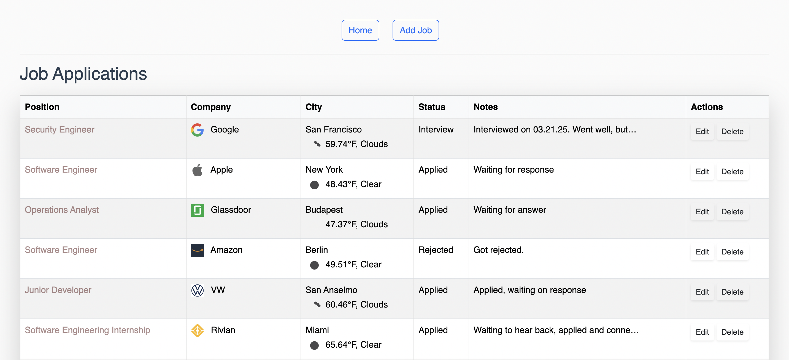
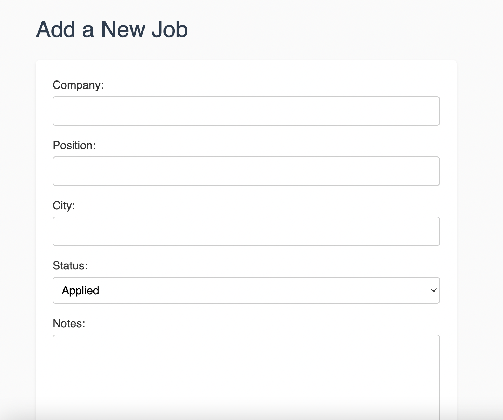

# Job Application Tracker 

**Live Demo** -> [https://job-application-tracker-zboz.onrender.com](https://job-application-tracker-zboz.onrender.com)

### Description: Full-stack Django web app to track job applications, including live weather by city, company logos and Bootstrap UI. 

### Features:
    This full-stack web app features the following:
    - Full CRUD functionality (Create, Read, Update, Delete job applications)
    - Live weather integration using OpenWeatherMap API
    - Company logos using Clearbit Logo API
    - Plentiful job details (position, company, city, status, notes, description)
    - Responsive, styled with Bootstrap
    - Keys stored safely with .env

### Tech Stack:
    - Backend: Django (Python)
    - Frontend: HTML, CSS, Bootstrap 5, Jinja
    - Database: SQlite3
    - APIs:
        - OpenWeatherMap (real-time weather by city)
        - Clearbit Logo API (company logos)

## Screenshots:

### Job List Page

### Add Job Form

### Ideas for Future Enhancements:
    - User authentication (multi-user capabilities)
    - Calendar/email integration 
    - AI resume tailoring
    - Search capabilities
    - Filtering

